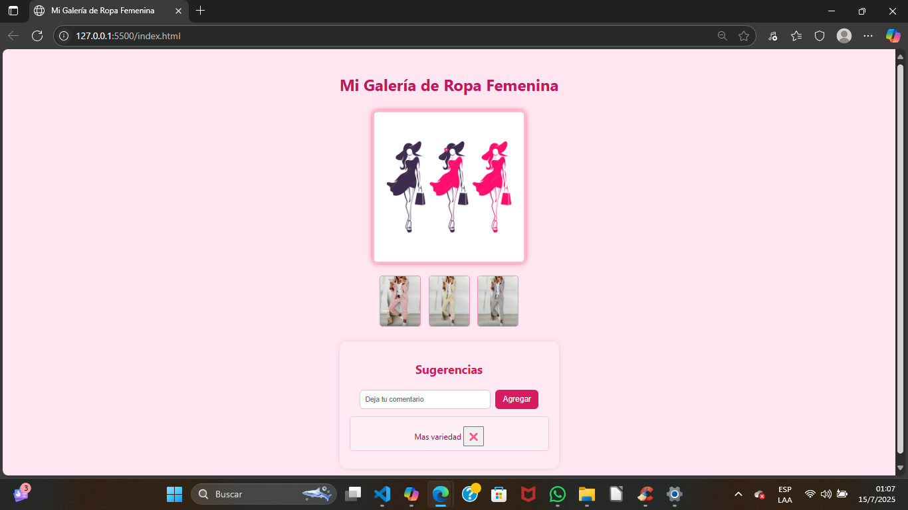

# Galería de Ropa Femenina - Proyecto Javascript

Este proyecto fue creado como parte del curso de Pilar Tecno. Presenta una galería web funcional.
Tecnologías utilizadas
- HTML
- CSS
- Javascript

